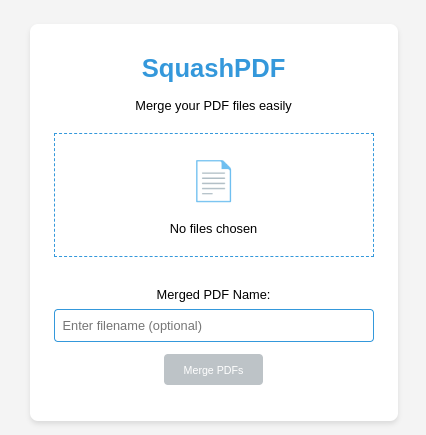

 # SquashPDF 📄🔀

## Overview
SquashPDF is a versatile file merging application that allows you to combine multiple file types into a single PDF document. Whether you're working with PDFs, images, or text files, SquashPDF makes merging files simple and intuitive.

## Features ✨
- Merge multiple file types into a single PDF
- Support for various file formats:
  - PDF files
  - Image files (JPG, PNG, GIF, BMP, TIFF)
  - Text files
- User-friendly graphical interface
- Easy file selection with preview
- Automatic file type conversion

## Prerequisites 🛠️
Before running SquashPDF, ensure you have the following installed:
- Python 3.7+
- pip (Python package manager)

## Installation 🚀

### 1. Clone the Repository
```bash
git clone https://github.com/yourusername/SquashPDF.git
cd SquashPDF
```

### 2. Create a Virtual Environment (Optional but Recommended)
```bash
python3 -m venv venv
source venv/bin/activate  # On Windows, use `venv\Scripts\activate`
```

### 3. Install Dependencies
```bash
pip install -r requirements.txt
```

## Dependencies 📦
- PyPDF2
- Pillow (PIL)
- tkinter
- img2pdf
- reportlab

## Usage 🖥️
Run the application:
```bash
python app.py
```

### How to Merge Files
1. Launch the application
2. Select file type from the dropdown
3. Choose files to merge
4. Select/deselect files using checkboxes
5. Click "Merge Selected Files"
6. Enter a name for the output PDF
7. Your merged PDF is ready!

## Supported File Types 📁
- PDF
- Images (JPG, PNG, GIF, BMP, TIFF)
- Text files

## Limitations ⚠️
- Text file conversion is basic
- Large or complex files might have conversion issues

